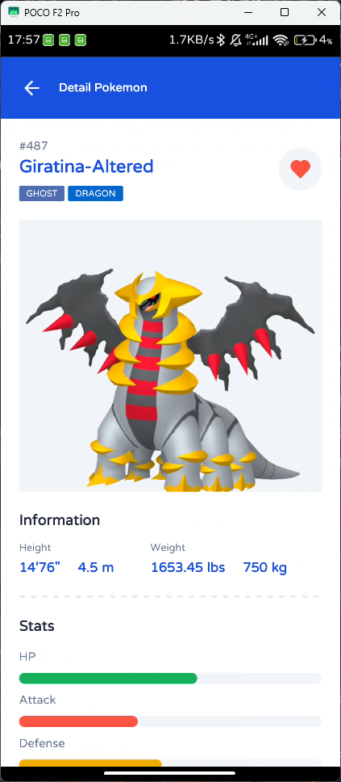

# RN Pokedex App

> **Note**: Make sure you have completed the [React Native - Environment Setup](https://reactnative.dev/docs/environment-setup) instructions till "Creating a new application" step, before proceeding.

## Start the Metro Server

First, you will need to start **Metro**, the JavaScript _bundler_ that ships _with_ React Native.

To start Metro, run the following command from the _root_ of your React Native project:

```bash
# using npm
npm start

# OR using Yarn
yarn start

# OR using Bun
bun start
```

## Start Application

Let Metro Bundler run in its _own_ terminal. Open a _new_ terminal from the _root_ of your React Native project. Run the following command to start your _Android_ or _iOS_ app:

### For Android

```bash
# using npm
npm run android

# OR using Yarn
yarn android
```

### For iOS

```bash
# using npm
npm run ios

# OR using Yarn
yarn ios
```

If everything is set up _correctly_, you should see your new app running in your _Android Emulator_ or _iOS Simulator_ shortly provided you have set up your emulator/simulator correctly.

This is one way to run your app — you can also run it directly from within Android Studio and Xcode respectively.

## Building the App

You can build your app using this command

### For Android

#### Cleaning Gradle Build

```bash
cd android/
./gradlew clean
```

#### Building APK Files

```bash
cd android/
./gradlew assembleRelease
```

#### Building AAB Files

```bash
cd android/
./gradlew bundleRelease
```

## Screenshot

### Splash Screen


### Home


### Pokemon Detail



### Favorites


## Videos

{ Comming Soon }
